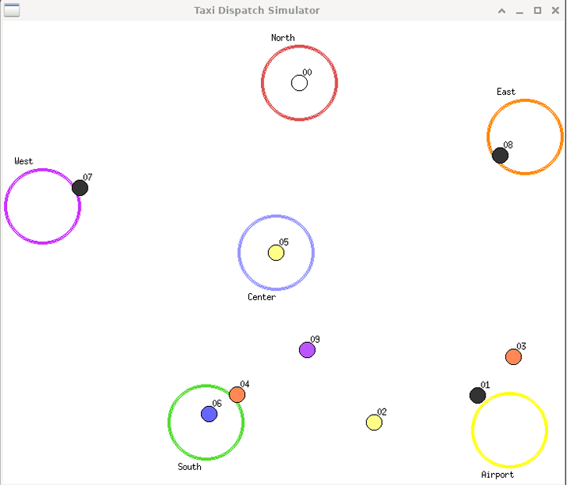

# 🚕 Taxi Dispatcher Simulation

A multi-process, socket-based taxi dispatch simulation written in C. The simulation models a city with 6 distinct areas, taxis navigating between them, and a central dispatch center coordinating customer pickup/dropoff requests — all visualized in real time using X11.



---

## 📋 Overview

The simulation consists of several cooperating programs:

| Component | Description |
|-----------|-------------|
| `simulator` | The main program — spawns taxis, starts the dispatch server, and opens the graphical window |
| `dispatchCenter` | A TCP server (embedded in `simulator`) that queues customer requests and coordinates taxis |
| `taxi` | Each taxi runs as a forked child process, autonomously requesting customers and sending location updates |
| `customer` | Sends a single ride request (pickup + dropoff) to the dispatch center |
| `generator` | Automatically and continuously generates random customer requests |
| `stop` | Gracefully shuts down the entire simulation |

### City Areas

The city has **6 named areas**, each with a fixed position on the map:

`North` · `East` · `Airport` · `South` · `Center` · `West`

Area indices `0–5` are used when making manual requests.

---

## 🛠️ Requirements

- Linux (tested on Ubuntu)
- GCC
- X11 / Xlib (`libx11-dev`)
- POSIX threads (`pthread`)

Install dependencies on Debian/Ubuntu:

```bash
sudo apt install gcc libx11-dev
```

---

## 🔨 Build

```bash
make
```

This will compile all components: `simulator`, `customer`, `generator`, and `stop`.

---

## 🚀 Usage

### 1. Start the simulation

Run the simulator in the background to keep your terminal free:

```bash
./simulator &
```

A graphical window will open showing the city map and taxis moving in real time.

---

### 2. Generate ride requests

**Option A — Manual request**

Send a single customer request by specifying a pickup area and dropoff area by index:

```bash
./customer <pickup_index> <dropoff_index>
```

**Example:** Request a ride from `Airport` (2) to `North` (0):

```bash
./customer 2 0
```

Area index reference:

| Index | Area    |
|-------|---------|
| 0     | North   |
| 1     | East    |
| 2     | Airport |
| 3     | South   |
| 4     | Center  |
| 5     | West    |

**Option B — Automatic request generator**

Let the generator continuously spawn random customer requests every 250ms:

```bash
./generator
```

---

### 3. Stop the simulation

When you're done, shut everything down cleanly:

```bash
./stop
```

This sends a shutdown command to the dispatch center and kills all related processes (`simulator`, `customer`, `generator`).

---

## 🗂️ Project Structure

```
.
├── simulator.c       # Main entry point — initializes taxis, threads, and window
├── simulator.h       # Shared constants, structs, and command codes
├── dispatchCenter.c  # TCP server handling taxi and customer requests
├── taxi.c            # Taxi process logic — movement, status updates
├── display.c         # X11 real-time graphical display
├── customer.c        # Client: sends a ride request to dispatch
├── generator.c       # Auto-generates random customer requests
├── stop.c            # Sends shutdown signal and kills all processes
└── Makefile
```

---

## 🖥️ How It Works

```
[generator / customer]
        |
        | REQUEST_TAXI (TCP)
        ▼
[Dispatch Center Server]  ◄──── UPDATE (position) ──── [Taxi Process(es)]
        |                  ────► REQUEST_CUSTOMER ─────►
        | queues requests
        ▼
   [Request Queue]
        ▲
[display thread reads shared state and renders via X11]
```

1. **Customers** connect to the dispatch server and submit a pickup/dropoff request.
2. The **dispatch center** queues requests (up to 99 at a time).
3. **Taxis** periodically connect to the server — if available, they request a customer; if en route, they send a position update.
4. The **display thread** continuously reads shared state and redraws the city window showing each taxi's position and status.

### Taxi Status Colors

| Color | Status |
|-------|--------|
| ⚫ Dark gray | Picking up a customer |
| 🔵🟣🟡 Area color | Dropping off (colored by destination area) |
| ⚪ White | Available |

---

## ⚙️ Configuration

Key constants are defined in `simulator.h`:

| Constant | Default | Description |
|----------|---------|-------------|
| `SERVER_PORT` | `6000` | TCP port for the dispatch center |
| `SERVER_IP` | `127.0.0.1` | IP address (localhost) |
| `MAX_TAXIS` | `99` | Maximum taxis supported |
| `MAX_REQUESTS` | `99` | Maximum queued customer requests |
| `NUM_CITY_AREAS` | `6` | Number of city areas |

---

## 📄 License

This project is provided for educational purposes.
